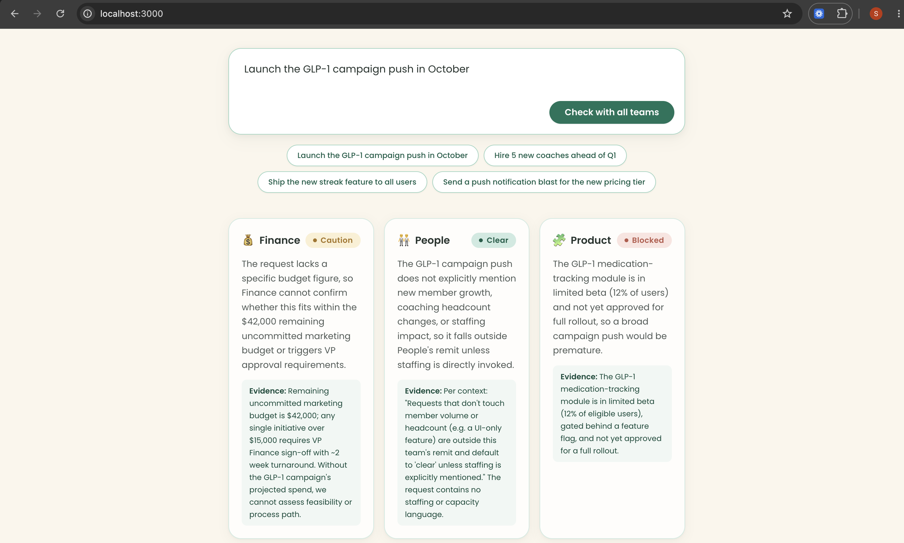
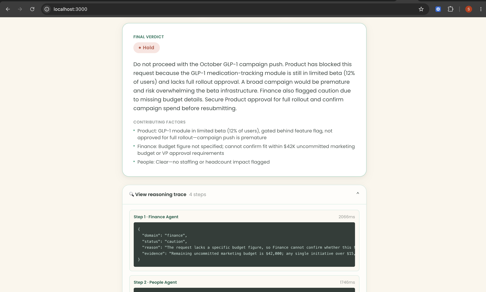
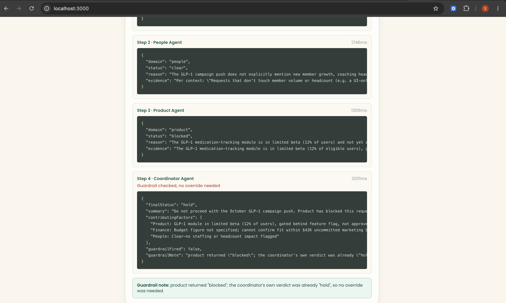

# Cross-Team Launch Coordinator

A concept prototype built for a Noom Agentic Engineer (New Grad) application. **Not an
official Noom product** — see the disclaimer at the bottom of every page.

## The problem, in plain English

Noom's production AI feature, **Welli**, is a single agent grounded in one shared
knowledge base — coaching, support, and content teams all curate the same source of
truth, and Welli answers member questions against it. That works because everyone
feeding Welli is looking at the same facts.

The Agentic Engineer role this was built for is about the next step: coordinating
*multiple* agents across teams that **don't** share context — product, marketing,
people, finance, growth. Those teams each have their own constraints (a budget line,
a staffing ratio, a feature's rollout status), and none of them can see each other's.
The interesting failure mode isn't "the AI gave a wrong answer" — it's "the AI
confidently greenlit something that one domain would have hard-blocked, because
nothing forced it to check."

This prototype makes that gap concrete: type a plain-English request like *"launch the
GLP-1 campaign push in October"* and it's checked against three domain agents that
never see each other's reasoning, then reconciled into one verdict — with a
code-level guardrail that a language model literally cannot talk its way around.

## What it looks like

**1. Type a request** — your own, or one of the one-click example chips:



**2. Three domain agents weigh in, independently** — each grounded only in its own
team's context, with the evidence that drove its answer shown alongside it, then
reconciled into one final verdict:



**3. Nothing is hidden** — the reasoning trace shows every agent's raw output, latency,
and whether the code-level guardrail had to override the coordinator's own judgment:



In this run, Product returned `"blocked"` (the GLP-1 tracking module is still in
limited beta), so the guardrail confirms the coordinator's own verdict was already
`"hold"` — no override needed. Flip Product to `"clear"` in a test scenario and the
guardrail *would* force an override even if the coordinator's LLM output disagreed;
that's exactly what `tests/guardrail.test.ts` checks for.

## Architecture

```
                     ┌─────────────────┐
  user request  ───► │  Finance Agent   │──┐
                     └─────────────────┘  │
                     ┌─────────────────┐  │      ┌────────────────────┐      ┌──────────┐
                  ─► │  People Agent    │──┼───►  │  Coordinator (LLM)  │───►  │ Guardrail │─► verdict
                     └─────────────────┘  │      └────────────────────┘      │ (plain code)│
                     ┌─────────────────┐  │                                  └──────────┘
                  ─► │  Product Agent   │──┘
                     └─────────────────┘
```

- **Three domain agents** (`lib/agents/finance.ts`, `people.ts`, `product.ts`) each get
  the user's request plus a short, fabricated "team context" paragraph, and independently
  return `{ status: "clear" | "caution" | "blocked", reason, evidence }` as Claude tool-use
  output — a synthetic tool is the *only* thing Claude is allowed to call, so free-text
  replies aren't possible, and a bad parse triggers one automatic retry
  (`lib/claude.ts`).
- **The coordinator agent** (`lib/agents/coordinator.ts`) reads all three verdicts and
  proposes a final `{ finalStatus, summary, contributingFactors }`.
- **The hard guardrail** (`lib/guardrail.ts`) is plain TypeScript, not a prompt: if *any*
  domain agent returned `"blocked"`, it forces `finalStatus` to `"hold"` regardless of
  what the coordinator's own text said, and records that the override happened. This is
  the actual point of the demo — the system is architected so a blocking constraint can
  never be silently downgraded by an LLM's own judgment.
- **The trace** (`app/api/coordinate/route.ts`) records each step in order — which
  agent ran, how long it took, its raw JSON, and whether the guardrail fired — and is
  shown in the "View reasoning trace" panel under the verdict. It's not hidden; showing
  the reasoning is deliberately part of the pitch.

Each domain agent also has its own standalone route (`app/api/agents/{finance,people,product}/route.ts`)
for direct testing, in addition to being orchestrated together by `/api/coordinate`.

## Stack

Next.js 14 (App Router) + TypeScript + Tailwind CSS, deployed to Vercel. All LLM calls
happen server-side in Next.js API routes via `@anthropic-ai/sdk` — the client never
talks to Anthropic directly, and `ANTHROPIC_API_KEY` never reaches the browser.

## Running locally

```bash
npm install
cp .env.example .env.local   # then paste in your real ANTHROPIC_API_KEY
npm run dev
```

Open http://localhost:3000. Click one of the example chips for a one-click demo, or
type your own request.

### Environment variables

| Variable            | Required | Description                                                                 |
| -------------------- | -------- | ---------------------------------------------------------------------------- |
| `ANTHROPIC_API_KEY`  | Yes      | From https://console.anthropic.com/. Server-side only — see `lib/claude.ts`. |
| `CLAUDE_MODEL`       | No       | Defaults to `claude-haiku-4-5`. Every agent call reads this env var; no model string is hardcoded anywhere. |

`.env.local` is gitignored — never commit real keys. `.env.example` documents the shape
without one.

### Deploying to Vercel

1. Push this repo to GitHub.
2. Import it in Vercel (framework preset auto-detects as Next.js — zero extra config).
3. In the Vercel project's **Settings → Environment Variables**, add `ANTHROPIC_API_KEY`
   (and `CLAUDE_MODEL` if you want to override the default) for Production/Preview.
4. Deploy.

## Evaluation suite & CI

`tests/guardrail.test.ts` runs 8 fixed scenarios (Vitest) directly against the guardrail
logic — e.g. "all three domains clear → `go`", "Finance blocked, others clear → `hold`
even when the coordinator's own LLM output says `go`", "People caution only →
`go_with_caution`, never `hold`". The coordinator's LLM call is mocked via dependency
injection (`decideFinalVerdict` takes the LLM caller as a parameter), so **no test ever
calls the real Anthropic API** — CI stays fast, free, and deterministic.

```bash
npm test          # run once
npm run test:watch
```

`.github/workflows/eval.yml` runs this suite on every push and pull request, so a future
change that weakens the guardrail (e.g. someone "simplifies" it to trust the LLM's
`finalStatus` outright) fails CI instead of shipping.

> The workflow caches npm dependencies by `package-lock.json`. Run `npm install` locally
> at least once and commit the generated `package-lock.json` before pushing, or the
> cache step has nothing to key off of.

## A note on the data

All "team context" shown in the app (budget figures, coach ratios, feature rollout
status) is fabricated for this demo. None of it is real Noom data — the point is to
demonstrate the coordination pattern, not to reproduce Noom's actual internal numbers.
